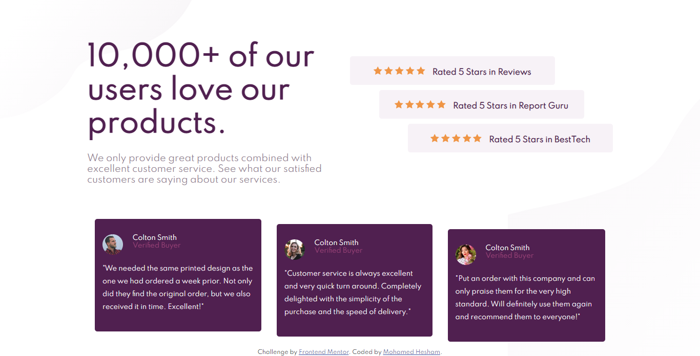

## Overview

### The challenge

Users should be able to:

- View the optimal layout for the section depending on their device's screen size
- The designs were created to the following widths:

- Mobile: 375px
- Desktop: 1440px

### Screenshot

### Links

- Solution URL: [solution URL](https://www.frontendmentor.io/solutions/html-css-vkBxv70u1)
- Live Site URL: [live site](https://mohamedhesham221.github.io/social-proof-section-master/)

### Built with

- Semantic HTML5 markup
- CSS custom properties
- Flexbox
- Mobile-first workflow

## Author

- [Mohamed Hesham]
- Frontend Mentor - [@mohamedhesham221](https://www.frontendmentor.io/profile/mohamedhesham221)
- linkedin - (https://www.linkedin.com/in/mohamed-hesham-b7611618a/)
